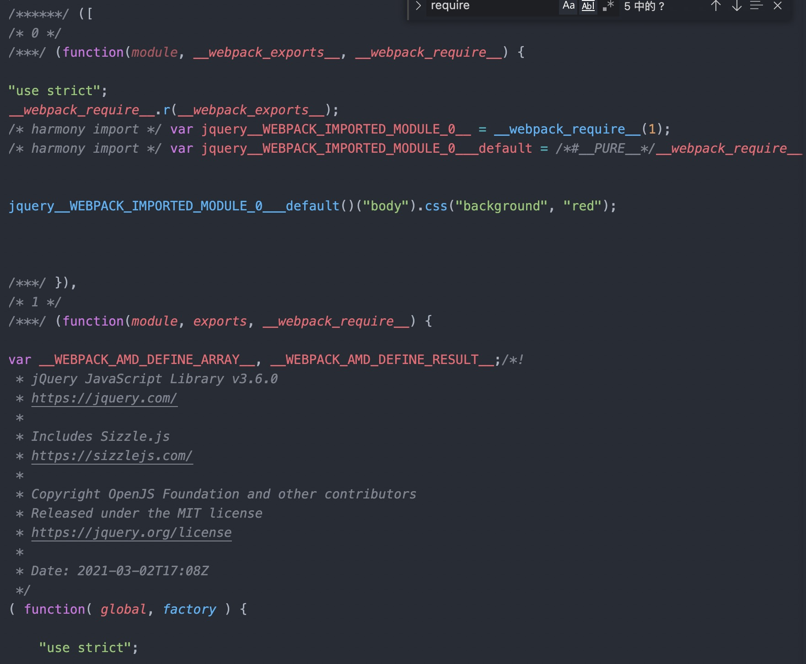
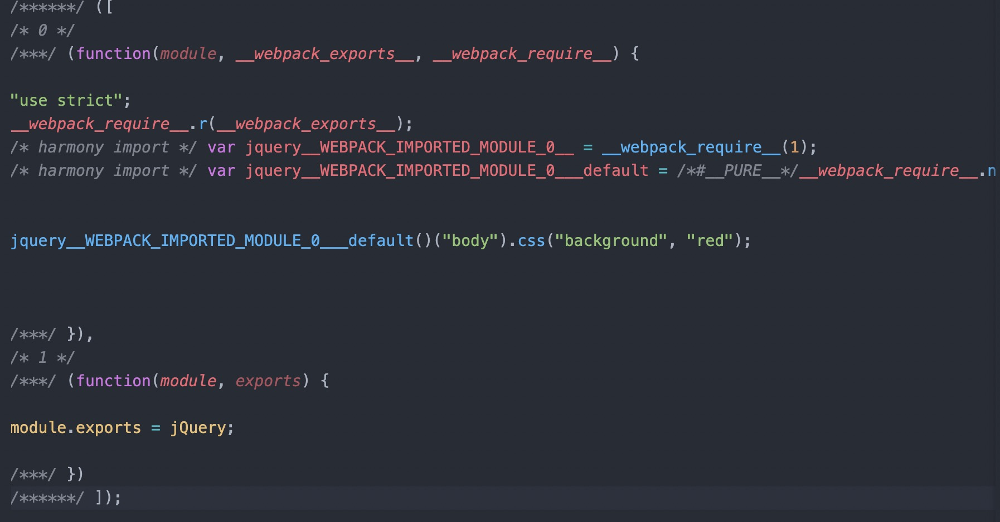

# 学习 Externals 配置

## 介绍

**排除打包结果中的指定依赖**。比如，当代码中通过`import $ from jquery`引入 jquery，并在 webpack 配置`externals:{jquery:jQuery}`时，webpack 打包构建将不会将`jquery`包打包到最终生成文件中，而是直接将`jQuery`的变量作为依赖结果导出。

## 用途

- 当想创建一个工具包提供给别人使用时，不希望将`jquery`，`lodash`这样的工具库也打包到结果中时
- SPA 时候为了加快 js 下载渲染，可以将一些固定的依赖（比如`jquery`），通过 CDN 来加载，打包中不需要添加该依赖
- Node 环境将一些外部依赖包通过 require 直接加载，不需要打包到代码中。例如：[webpack-node-externals
  ](https://www.npmjs.com/package/webpack-node-externals)

## 基本使用

```javascript
// index.js
import $ from "jquery";

$("body").css("background", "red");
```

```javascript
// webpack.config.js
module.exports = {
  entry: "./index.js",
  output: {
    path: __dirname + "/dist",
    filename: "bundle.js",
  },
  mode: "none",
  externals: {
    jquery: "jQuery",
  },
};
```

## 设置 externals 后的打包结果对比

未添加 externals 配置时：



引入了 jquery 包源代码到最终打包结果中。

添加 externals 配置时：



没有打包源代码到打包结果中，只是导出了一个环境中的`jQuery`变量作为模块依赖。需要用户环境中存在该变量，比如通过 cdn 提前引入该资源。

## 几种配置形式

externals 的配置主要告诉 webpack 两件事情：

1. 要排除打包的依赖名称。依赖名称可以是包名（jquery）,文件路径('./a/b')，自定名称等。
2. 用户模块环境（Commonjs、AMD、全局变量、ES2015 模块）是什么，如何引入用户环境的该依赖。

### string

```javascript
  {
    externals: {
      jquery: "jQuery",
    }
  }
```
用来告诉webpack，当遇到`import $ from jquery`或者`const $ = require('jquery')`引入jquery（对象key值）时,不将jquery源代码打包到最终结果中，而是直接导出用户环境jQuery（对象value值）变量作为依赖。这就需要用户环境中存在全局变量jQuery。

在浏览器环境中，可以通过cdn提前引入jquery，这样`jQuery`变量就可以在全局访问，但是在Node的环境中，无法通过script标签的形式为环境挂载`jQuery`变量。更友好的方式是在使用时再require`node_modules`中的jquery包。externals 提供了指定模块上下文的形式。


## `output.libraryTarget`对 externals 的影响

默认`libraryTarget`为`var`

## 参考链接

- [webpack externals 官方文档](https://v4.webpack.docschina.org/configuration/externals/#array)
- [webpack externals 深入理解](https://segmentfault.com/a/1190000012113011?utm_source=tag-newest)

各种配置方式的含义，怎么使用
